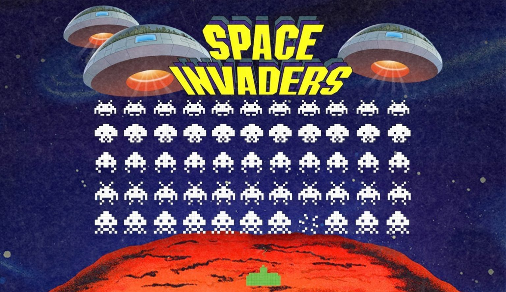

# Trabalho final

Para este trabalho, você deve utilizar os conteúdos vistos no curso para desenvolver o game [Space Invaders](https://jogoveio.com.br/space-invaders-e-falta-de-moedas/).

## Pontuação
Ao todo, este trabalho vale 45 pontos. Para obter os pontos, você deve realizar as tarefas abaixo. 

 - **Tela Pygame (2 pontos):** você deve exibir a tela do game corretamente, ao executar seu código python. Esta tela deve ter o tamanho de 600x600.
 - **Título "SPACE INVADERS - SEU NOME" (2 pontos):** A descrição acima, deve aparecer corretamente, no título da janela.
 - **Posicionando bots corretamente (10 pontos):** Você deve posicionar os bots corretamente.   
    - Utilize o ponto x = 50 e y = 50, para o bot no canto superior esquerdo. 
    - Utilize altura de 35 e largura de 35 para todos os bots. 
    - Distancie cada um dos bots em 15 pixels.
 - **Posicionando o personagem (2pontos):** Você deve posicionar o personagem na posição y = 560, x = 285. Seu personagem também deve ter largura e altura = 35.
 - **Movimentando os bots (3 pontos):** Os bots devem se mover todos juntos, para a direita, para baixo e para a esquerda, até que chegue no canto inferior da tela.
 - **Movimentando o personagem (2 pontos):** Seu personagem deve se mover para a esqueda, quando pressionado a tecla de seta para esquerda. Também deve se mover para a direita quando for pressionado a tecla seta para direita.
 - **Limitando o movimento do personagem (2 pontos):** Seu personagem deve ter o movimento limitado, para que não atravesse a tela nem pelo lado esquerdo, nem pelo lado direito.
 - **Disparo do personagem (3 pontos):** Seu personagem deve ser capaz de disparar um projetil ao pressionar a tecla 'a', este projetiu deve se mover para cima, até acertar algum dos bots ou sair da tela.
 - **Capturando colisão corretamente (4 pontos):** Após o projétil ser disparado, você deve capturar verificar se este projétil colidiu com algum dos bots, caso tenha ocorrido a colisão você deve fazer que:
   - O disparo desapareça;
   - O bot seja removido do game;
 - **Adicionar legenda de nível (3 pontos):** Você deve adicionar no seu game, uma forma de recomeçar uma nova fase, e exibir o nivel na tela.
 - **Adicionar imagem de fundo (2 pontos):** Você deve adicionar uma imagem de fundo ao seu game.
 - **Adicionar fundo animado (2 pontos):** Seu game se tornará mais divertido se o fundo for animado, então, você deverá adicionar um fundo animado, ao invés de uma imagem estática.
 - **Adicionar uma imagem no personagem (2 pontos):** Você deve adicionar uma imagem para seu personagem.
 - **Adicionar animação ao personagem (3 pontos):** Você deve adicionar uma animação para quando o personagem estiver parado, e também para quando ele se mover para esquerda ou direita.
 - **Adicionar fases infinitas (3 pontos):** Faça com que o game, reinicie uma nova fase quando o usuário perder o game ou quando derrotar todos os monstros.
